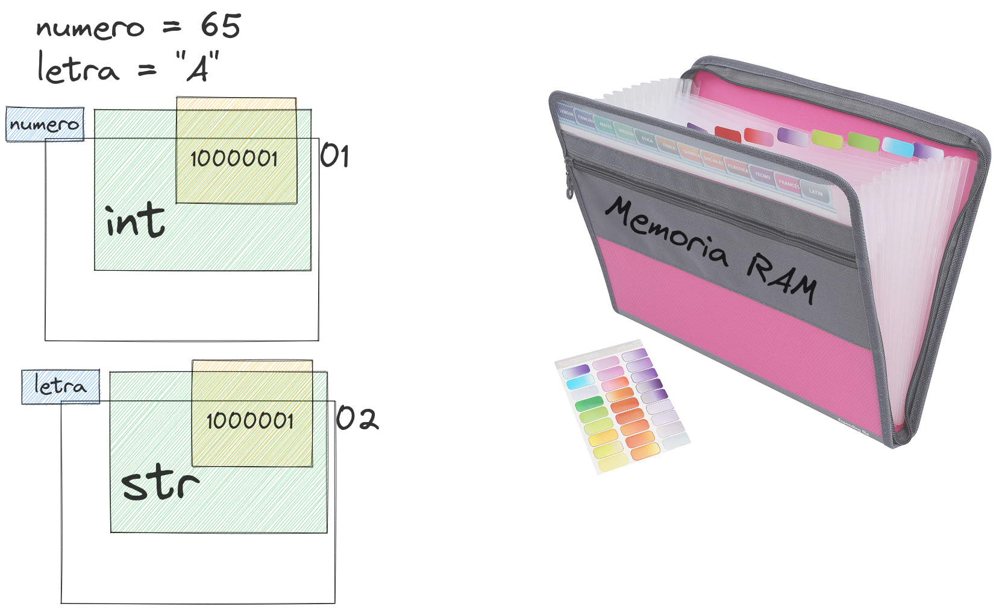

# Protocolos e Tipos Primários

Todas as informações que usaremos durante a programação são representadas na
memória do computador através de um **tipo de dado**, você também vai ouvir
os termos **classe** ou **categoria** para se referir a mesma coisa.

Lá no comecinho do treinamento nós falamos brevemente que o computador só
entende sequencias de `0` e `1`, os binários, portanto quando fazemos uma 
atribuição como `numero = 65` o Python precisa preparar o espaço de memória
necessário para armazenar o binário `1000001` e junto deste valor armazenar
a referencia aos métodos e operações suportadas pelo número.

Você pode abrir um terminal Python agora ai e verificar:

```bash
python3 -c "print(bin(65))"
'0b1000001'
```

Acontece que caso nosso valor seja um texto como em `letra = "B"` o valor
`"B"` vai precisar ser armazenado também como uma sequência binária, e você
pode verificar no seu terminal Python.

```bash
python -c "print(chr(66))"
B
```
e 
```bash
python3 -c "print(bin(66))"
0b1000010
```

No caso do texto o Python precisa armazenar a sequência binária `1000010` e
também junto deste valor armazenar a referência para a tabela
de caracteres onde na posição `66` teremos a letra `B`.

Para simplificar esse conceito, considere que a memória RAM é uma pasta fichário 
de documentos:


 E dentro deste fichário/arquivo em cada pasta ela possui:

- Uma posição (primeira, segunda, teceira)
- Uma etiqueta (identificador, variável)
- Um envelope contendo:
	- Instruções de como usar aquela informação
	- A informação em sí

Em Python podemos representar esta analogia com:

```py
# Colocamos um valor no fichário usando a Atribuição
# aproveitamos para colocar uma etiqueta escrita o identificador "letra"
>>> letra = "B"

# Python teve que achar uma pasta vazia para armazenar nosso valor
# a função id() nos diz qual é número dessa posição
>>> id(letra)
139862029254896

# Python precisou colocar o valor "100010" dentro de um envelope
# neste envelope contém também instruções de como usar este valor para obter
# a letra "B".
# a função type() nos diz qual tipo de envelope foi usado
>>> type(letra)
str
```



Todos os objetos em **Python** são formados por essas 3 propriedades:

- valor `"1000010" ou "B"`
- tipo ou classe `str, int, float, ...`
- posição na memória `o número retornado pela função id()`

## Porque usamos tipos de dados?

Para não precisar manipular os dados manualmente, por exemplo, não precisamos
nos preocupar com o fato de que cada letra de um texto é armazenada como um 
número binário, usamos os tipos de dados definidos pelas classes para utilizar 
abstrações que nos entreguem diretamente a letra "B" que queremos.

Também não precisamos nos preocupar com a posição da memória, para nós tanto
faz se o Python armazenou na primeira ou na última pasta da memória, o importante
em nossa camada de abstração é sabermos qual é a etiqueta colada lá, e quando
precisamos do valor usamos a etiqueta para encontrar, portanto se quisermos
obter o "B" usamos a referência "letra".

```py
>>> print(letra)
B
```

Existem vários tipos de dados para representar uma infinidade de valores e
podemos também criar os nossos próprios tipos de dados.

Eles estão divididos em 2 categorias, os **primários** e os **compostos**, vamos
começar explorando os primários e depois que entendermos todo os seu funcionamento
passaremos para os tipos compostos.

## Primários

Os tipos primários também chamados de tipos "escalares" (**scalar types**) são
utilizados para armazenar uma única unidade de informação como por exemplo um
número ou um texto como vimos anteriormente.

### Inteiros

O tipo usado para armazenar os números inteiros em Python é representado pela
classe `int`, em Python nós não precisamos declarar qual o tipo de dado a ser 
usado pois o Python faz a inferência de tipos dinâmicamente, o interpretador
primeiro verifica como o valor se parece e então decide por conta própria
qual a classe a ser utilizada, exemplos de uso de `int`

```py
# a idade de uma pessoa
idade = 25

# o código de um produto
codigo_produto = 4587

# quantidade de itens
quantidade = 3
```

Em qualquer um dos casos acima o Python irá armazenar como `int` e você pode
usar a função `type` para verificar.

```py
>>> type(idade)
int
```

Você até pode se desejar, forçar o tipo de dado explicitamente, mas isso é
considerado redundante.

```py
idade = int(25)  # isso funciona, mas é redundante
```

`idade` é um identificador que faz referência ao valor `25` e nós podemos fazer
uma variedade de operações com este valor, essas operações fazem parte do que
chamamos `Protocolo` do objeto, e quem define os protocolos que o objeto 
implementa é a classe `int`.

Você pode em seu terminal verificar todos os protocolos que o `int` implementa
e se você está começando agora com Python pode ser que isso ainda não faça
muito sentido, não se preocupe, nosso objetivo aqui no treinamento é deixar
esses conceitos cada vez mais naturais para você.

Verificando quais comportamentos estão no protocolo de um tipo de dado.

```py
>>> dir(int)
# atributos especiais da classse int
['__abs__',
 '__add__',
 '__and__',
 '__bool__',
 '__ceil__',
 '__class__',
 '__delattr__',
 '__dir__',
 '__divmod__',
 '__doc__',
 '__eq__',
 '__float__',
 '__floor__',
 '__floordiv__',
 '__format__',
 '__ge__',
 '__getattribute__',
 '__getnewargs__',
 '__gt__',
 '__hash__',
 '__index__',
 '__init__',
 '__init_subclass__',
 '__int__',
 '__invert__',
 '__le__',
 '__lshift__',
 '__lt__',
 '__mod__',
 '__mul__',
 '__ne__',
 '__neg__',
 '__new__',
 '__or__',
 '__pos__',
 '__pow__',
 '__radd__',
 '__rand__',
 '__rdivmod__',
 '__reduce__',
 '__reduce_ex__',
 '__repr__',
 '__rfloordiv__',
 '__rlshift__',
 '__rmod__',
 '__rmul__',
 '__ror__',
 '__round__',
 '__rpow__',
 '__rrshift__',
 '__rshift__',
 '__rsub__',
 '__rtruediv__',
 '__rxor__',
 '__setattr__',
 '__sizeof__',
 '__str__',
 '__sub__',
 '__subclasshook__',
 '__truediv__',
 '__trunc__',
 '__xor__',
 
 # daqui para baixo estão atributos públicos que podemos usar diretamente
 'as_integer_ratio',
 'bit_count',
 'bit_length',
 'conjugate',
 'denominator',
 'from_bytes',
 'imag',
 'numerator',
 'real',
 'to_bytes']
```

A lista acima exibe os nomes de todos os atributos dos objetos armazenados com
a classe `int`, tudo o que começa com `__` e termina com `__` nós chamamos de
**métodos dunder** e eles são atributos especiais do modelo de dados do Python,
nós não precisamos usar esses atributos diretamente em nosso código (apesar de
algumas vezes eles úteis), nós iremos utilizar abstrações que por baixo dos panos
irão fazer a chamada para esses métodos.

Neste momento nós não vamos falar de todos eles pois são muitos e a idéia é que
aos poucos você vá entendendo conforme utiliza, mas vamos explorar um exemplo
simples e que provavelmente usaremos sempre.

#### Protocolo Addible

Um dos métodos ali na lista retornada pelo `dir(int)` é chamado `__add__` 
(Dunder Add), **add** em português significa **adicionar** e todo objeto
em Python que possui este método `__add__` nós chamamos de um objeto
`Addible` e isso significa que com este objeto podemos efetuar operações
de adição, ou seja, podemos somar um número a outro.

Exemplo:

```py
preco = 10
imposto = 2
total = preco + imposto
```

No exemplo acima fizemos uma operação de some utilizando 2 objetos inteiros `preco`
e `imposto` e para efetuar a operação usamos o operador `+` que é exatamente o
que aprendemos nas aulas de matemática básica na escola.

Acontece que por debaixo dos panos, o Python ao interpretar `total = preco + imposto`
vai na verdade efetuar outra operação, ele vai fazer:

```py
total = preco.__add__(imposto)
```

O operador `+` é um simbolo que faz o Python invocar o método `__add__` no objeto
que está do lado esquerdo de uma expressão.

> **IMPORTANTE** NO dia a dia nós usamos apenas os operadores da forma abstraida
> por exemplo `1 + 1`, `10 - 8`, `5 * 4` etc.. porém é importante você saber
> como isso é implementado pelo Python pois através de uma lista de atributos
> você será capaz de determinar o que aquele objeto suporta de operações.

Todos os outros comportamentos que esperamos de um número inteiro também estará
implementado naquela lista, alguns exemplos.

- A operação `preco - desconto` internamente é `preco.__sub__(desconto)`
- `preco * quantidade` é `preco.__mul__(quantidade)`
- `preco / parcelas` é `preco.__div__(parcelas)`

Essas são as 4 operações matemáticas básicas, mas para todos os outros operadores
como potenciação `**` -> `__pow__`, módulo `%` -> `__mod__` terá sempre um desses
métodos dunder especiais.

E não apenas para operações matemáticas, essa lógica vai seguir para qualquer
outra expressão do Python, será muito comum nós fazermos comparações como fizemos 
em nosso script `hello.py`

```py
if current_language == "pt_BR":
    msg = "Hello, World!"
```

A parte `current_language == "pt_BR"` irá invocar o protocolo `Comparable` que
faz com que o objeto possa ser comparado com outro e o método Dunder que 
implementa essa funcionalidade é o `__eq__`, pode testar com:

```py
>>> idade = 25
# comparando por igualdade
>>> idade == 25
True
# o mesmo resultado
>>> idade.__eq__(25)
True
```

> **IMPORTANTE** Lembre-se que não usamos o `.__eq__` diretamente, quem faz isso
> para nós é o interpretador quando ele encontra o sinal de `==`

Teremos um método dunder similar ao `__eq__`  no objeto para todos os outros
operadores de comparação como por exemplo `>` -> `__gt__`, `<` -> `__lt__`, 
`>=` -> `__ge__`, `<=` -> `__le__` e assim por diante.

Esta mesma lógica vai ser usada para todos os outros tipos de dados em Python,
vamos agora ver brevemente mais alguns.

