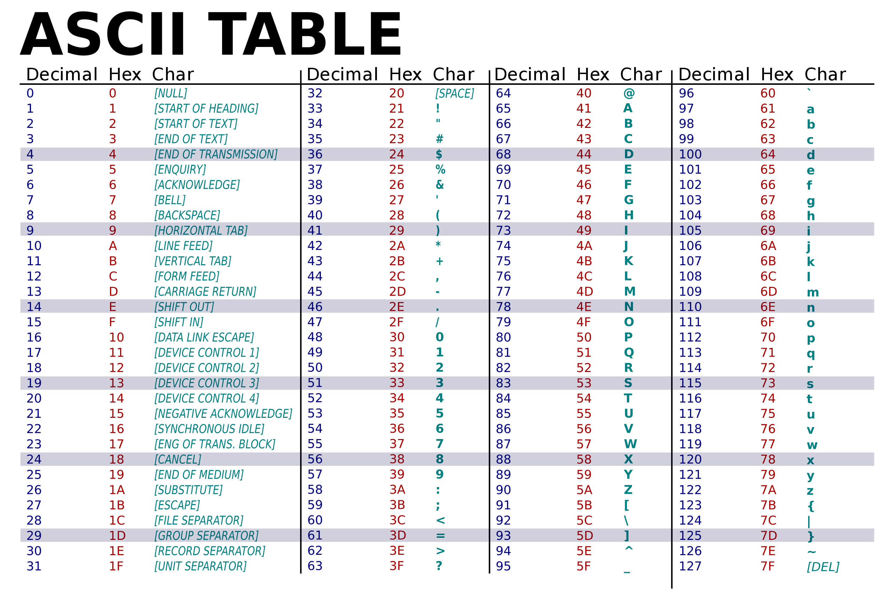

### Textos

#### Caracteres

Agora sim vamos falar do último dos 4 tipos primários que abordaremos que é
o tipo usado para armazenar texto.

Tudo o que você aprendeu até agora sobre protocolos e métodos especiais também
se aplica aos textos, mas os textos tem uma pequena particularidade, eles
são formados por caracteres.

```py
>>> chr(65)
A
>>> chr(66)
B
>>> chr(67)
C
```

Portanto o texto `"ABC"` internamente contém um conjunto de 3 caracteres em suas
respectivas posições na tabela de caracteres.

Existem várias tabelas de caracteres usadas na computação mas nesse treinamento
vamos ficar em apenas duas `ascii` e `utf8`.

A tabela `ASCII` possui 128 posições, ou seja, vai do 0 ao 127 e em cada posição
armazena apenas um caracter.




Estes são os carecteres básicos da lingua inglesa e como pode perceber ela não
considera acentuação ou carecteres especiais de outros idiomas como Russo ou 
Mandarim.

Quando a computação globalizou foi preciso mudar de tabela e adotar uma maior que
pudesse comportar uma quantidade universal de caracteres e também os `emojis` que
se tornaram parte da comunicação moderna.

A tabela `unicode` de `8 bits` - **utf8** atualmente tem 120 mil caracteres.

https://unicode-table.com/en/

Nesta tabela além da tabela ASCII padrão, apartir da posição `128` temos acentuação
e sub tabelas para simbolos e emojis.

Na tabela `ASCII` cada caracter ocupava menos de 1 byte (7 bits) e por isso que
`A` é `65` que na tabela é `1000001` (7 digitos).

Já na tabela unicode cada caractere pode ser formado por mais de um byte, por
exemplo, uma letra com acento `Ã` ocupa 2 bytes `11000011 10000011` na tabela.

E alguns emojis como o 🍉 ocupam 4 bytes `11110000 10011111 10001101 10001001`

Durante a programação com Python nós iremos considerar que nossos textos 
utilizam os caracteres disponíveis na tabela `utf8` e em alguns raros casos
no Python3 teremos que explicitamente fazer operações de `encode` e `decode` a
partir de um texto `ascii` para `utf-8`.

```py
# variável
fruit = "🍉"

# para transmitir este texto ou gravar em um arquvivo
# ou banco de dados pode ser necessário encodificar ele.
>>> fruit.encode("utf-8")
b'\xf0\x9f\x8d\x89'
```

Esse valor `b'\xf0\x9f\x8d\x89'` é um objeto do tipo `bytes` e repare que ele
tem 4 elementos separados por `\` cada um deles é um dos bytes que formam a 🍉

A operação contrária, por exemplo quando lermos de um arquivo ou banco de 
dados que não suporta `utf8` será com o `decode`.

```py
melancia_em_bytes = b'\xf0\x9f\x8d\x89'
>>>  melancia_em_bytes.decode("utf-8")
'🍉'
```

O objeto ali iniciado por `b''` é uma sequencia de bytes em formato hexadecimal
a titulo de curiosidade

- f0 = 11110000 
- 9f = 10011111 
- 8d = 10001101 
- 89 = 10001001

Que são os 4 bytes que formam o carecte 🍉 e você pode verificar isso no Python
com cada um dos valores da lista:

```py
>>> hex(0b11110000)
'0xf0'
```

Em Python números começados com `0b` são binários e `0x` são hexadecimais.

#### Strings, ou cadeia de caracteres

Até aqui falamos de caracteres isolados como `A`, `B`, `🍉` mas ao programar
também precisaremos juntar esses carecteres para formar palavras e frases,
quando criamos uma variável do tipo texto em Python ele através da presença
de aspas sejam elas simples `'` ou duplas `"` armazena esse valor em uma classe
do tipo `str` e este tipo de dado pode armazenar um ou mais caracteres.

```py
>>> nome = "Bruno"
type(nome)
```

E como você já deve ter imaginado aqui estamos armazenando cada uma das letras
`B`, `r`, `u`, `n`, `o` com seus respectivos bytes e sequencia posicional em um
único objeto. (a plavra string significa corda, cadeia ou corrente),

A palavra `"Bruno"` é uma lista contendo em cada posição um caractere da tabela
`utf8`.

```py
>>> list(bytes(nome, "utf-8"))
[66, 114, 117, 110, 111]

>>> chr(66)
'B'

>>> chr(114)
'r'

>>> chr(117)
'u'

>>> chr(110)
'n'

>>> chr(111)
'o'
```

Bem, para guardar o nome "Bruno" você mais uma vez não precisa se procupar com
esses detalhes todos, basta fazer `nome = "Bruno"` e usar este texto para efetuar
as operações que você desejar, porém é muito útil saber como o objeto está
implementado pois isso te permite efetuar operações como a que fizemos em 
nosso script `hello.py`

```py
current_language = os.getenv("LANG", "en_US")[:5]
```

Sabendo que `current_language` poderia ter o valor `en_US.utf8` nós usamos
o protocolo `Sliceable` do objeto `str` para **fatiar** o texto e pegar
somente os primeiros 5 caracteres.

```py
>>> "en_US.utf8"[:5]
'en_US'

>>> "Bruno"[2]
'u'

>>> "Python"[0]
'P'
```

O tipo `str` possui a maioria das carecteristicas que já abordamos nos outros
tipos de dados e uma grande quantidade de protocolos implementados, vamos ver
alguns.

```py
# Sliceable (pode ser fatiado)
>>> "Bruno"[1]
'r'
# que internamente invoca o método `__getitem__`
>>> "Bruno".__getitem__(1)
'r'

# Addible (pode ser adicionado a outro texto)
# Essa operação se chama "Concatenação"
>>> nome = Bruno" 
>>> sobrenome = "Rocha"
>>> nome + " " + sobrenome
'Bruno Rocha'
# que internamente invoca o método `__add__`
>>> nome.__add__(" ".__add__(sobrenome))
'Bruno Rocha'

# Multipliable (que pode ser multiplicado)
>>> "Bruno" * 5
'BrunoBrunoBrunoBrunoBruno'

# Iterable (que pode ser iterado/percorrido)
>>> for letra in "Bruno":
...     print("-->" + letra.upper())
-->B
-->R
-->U
-->N
-->O
# Internamente o statement `for` invoca o método `__iter__`
>>> iterador = "Bruno".__iter__()
>>> next(iterador)
'B'
>>> next(iterador)
'r'
```

Além disso tudo, o tipo `str` também oferece muitos métodos públicos, que nós
podemos usar explicitamente e que são muito úteis.

```py
>>> "Bruno".upper()
'BRUNO'

>>> "BRUNO".lower()
'bruno'

>>> "bruno rocha".capitalize()
'Bruno rocha'

>>> "bruno rocha".title()
'Bruno Rocha'

>>> "bruno rocha".split(" ")
['bruno', 'rocha']

>>> "bruno".startswith("b")
True

>>> "bruno".endswith("b")
False

>>> "bruno rocha".count("o")
2

>>> "bruno rocha".index("c")
8
>>> "bruno rocha"[8]
'c'
```

E também algumas coisas que podemos fazer com qualquer objeto sequencial do
Python:

```py
>>> len("Bruno Rocha")
11

>>> sorted("Bruno Rocha")
[' ', 'B', 'R', 'a', 'c', 'h', 'n', 'o', 'o', 'r', 'u']

>>> list(reversed("Bruno Rocha"))
['a', 'h', 'c', 'o', 'R', ' ', 'o', 'n', 'u', 'r', 'B']
```
