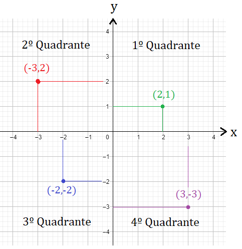

# Tipos compostos

Com os tipos `primários` temos a limitação de representar apenas uma única
informação em cada objeto, porém existem casos em que desejamos compor um
objeto único que contém mais de uma informação e para isso usamos os tipos
compostos.

## Tuplas

As tuplas são o tipo composto mais simples de todos e bastante comum de serem
usadam em Python, da mesma forma que anteriormente vimos que a string "ABC" é
uma sequência de carecteres, com as tuplas conseguimos fazer uma sequência de 
valores que podem ser de qualquer tipo.

Exemplo de um sistema que armazena coordenadas sem o uso de tuplas:

```py
coord_x = 140
coord_y = 200
coord_z = 9
```

Coordenadas desta forma são muito úteis em softwares de desenho gráfico ou
mapas, ali temos a reta `x` e a reta `y` de um plano cartesiano, e ainda estamos
adicionando a coordenada `z` que é a profundidade, usada em sistemas 3d.



Cada uma das coordenadas se refere a um ponto nessa reta e para definir um 
**único** ponto nós usamos 3 variáveis e isso fica muito dificil de manter
caso nosso sistema tenha muitas dessas coordenadas, e ai que entram as tuplas.

```py
coord = 140, 200, 9

# ou

coord = (140, 200, 9)
```

Em Python sempre que um ou mais objetos forem encadeados com `,` isso será
interpretado como um objeto do tipo `tupla` e a tupla pode opcionalmente ter
paranteses, nos já usamos tupla lembra? quando falamos de interpolação de textos.

```py
"Olá %s você é o %03d da fila" % (nome, senha)
```

No exemplo acima de interpolação os parenteses são obrigatórios mas 
no caso das nossas coordenas o jeito mais comum de declarar é mesmo usando
a sintaxe sem os parenteses e usar os parenteses comente quando for necessário
para desambiguar

```py
coord = 140, 200, 9
```

Portanto com este tipo de objeto não temos mais as variaveis `x` e `y` e `z`, 
agora temos uma única `coord` e para acessar os objetos que estão dentro da 
tupla usamos o protocolo de **subscrição**, os objetos que possuem um método
chamado `__getitem__` permitem que a gente acesse seus elementos usando `[ ]` e
nós também já fizemos isso lá no primeiro script quando fatiamos a variável de 
ambiente. (`current_language = os.getenv("LANG")[:5]`)

Então digamos que precisamos em nosso **jogo** posicionar um objeto na tela
naquela exata coordenada como fazemos?


```py
coord = 140, 200, 9

mover_x_para_coordenada(coord[0])
mover_y_para_coordenada(coord[1])
mover_z_para_coordenada(coord[2])
```

Repare que podemos acessar `coord[0]` e assim por diante usando `[numero]` e este
número se refere a posição do valor que queremos dentro da tupla.

Nestes casos, assumimos que seu software na hora de criar a variavel `coord` se
encarrega de colocar cada coisa em seu devido lugar :)

Existe uma infinidade de usos práticos para as tuplas, nós ainda falaremos muito
delas durante o treinamento e faremos os principais usos como em retorno de funções
e leitura de banco de dados.

### Desempacotamento

A caracteristica mais interessante das tuplas se chama **unpacking** ou 
desempacotamento em português. 
(algumas linguagens chamam isso de **spread, espalhamento, explode**)

O desempacotamento permite fazer a operação contrária da atribuição olha que 
interessante.

```py
# Empacotamento (atribuição)
coord = 140, 200, 9

# Desempacotamento (atribuição multipla)
x, y, z = coord
```

No desempacotamento o Python automaticamente vai pegar cada um dos elementos
da tupla e usar para definir as variaveis que separarmos por `,`.


> Aliás, está ai uma dica que ainda não falamos, é possível atribuir mais de
> uma variável ao mesmo tempo em Python
> `a, b, c, d = None` faz com que todas sejam referencias para `None`

### Imutabilidade

Outra caracteristica importante e que talvez seja decisiva na hora de escolher
usar tuplas é o fato de que elas são imutáveis, uma vez criada a tupla, não
é possivel alterar, não dá para mudar os valores ou adicionar novos. 
(este tópico contém  algumas excessões que veremos na nossa aula sobre escopos)

### Algumas coisas que podemos fazer com as tuplas

```py
# Atribuir sem parenteses
coord = 140, 200, 9

# atribuir com parenteses
coord = (140, 200, 9)

# desempacotar
x, y, z = coord

# ignorar elementos (será atribuito apenas o x)
x, *_ = coord

# pegar apenas o primeiro e o último elemento
x, *_, y = coord

# Verificar o tamanho
len(coord)
3

# Acessar via subscrição pelo indice
coord[0]
140

# fatiar
coord[1:]
(200, 9)
```