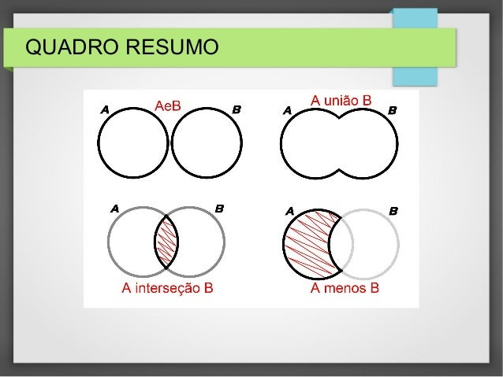

## Sets

Na antiga 5 séria (atual 1 ano do ensino médio) aprendemos a teoria dos conjuntos.



Python tem um tipo de objeto para representar este tipo composto,
as caracteristicas de uso são bastante similares com listas e tuplas,
mas é um objeto bastante particular e tem usos especificos.

Sets podem ser criados usando as sintaxes:

```py
# A partir de qualquer objeto iterável
iteravel = [1, 2, 3]  # list
iteravel = 1, 2, 3  # tuple
iteravel = "Banana"  # str

# usando a classe
set(iteravel)

# usando literais com { e }
{1, 2, 3, 4}

# desempacotando tuplas, listas ou textos
{*iteravel}
```

Aplicamos a teoria dos conjuntos usando operadores


```py
>>> conjunto_a = [1, 2, 3, 4, 5]
>>> conjunto_b = [4, 5, 6, 7, 8]

# | para união
>>> set(conjunto_a) | set(conjunto_b)
{1, 2, 3, 4, 5, 6, 7, 8}

# & para intersecção
>>> set(conjunto_a) & set(conjunto_b)
{4, 5}

# – para diferença
>>>  set(conjunto_a) - set(conjunto_b)
{1, 2, 3}

# para ^ diferença simétrica
>>> set(conjunto_a) ^ set(conjunto_b)
{1, 2, 3, 6, 7, 8}
```

Interessante mas você pode estar se perguntando onde usar isso?

Pensa em uma rede social como o twitter, no conjunto A estao as pessoas
que você segue, no conjunto B estão as que te seguem de volta, com este
objeto você consegue determinar rapidamente quem não está te seguindo de volta.

Você pode também usar set para determinar quais seguidores você e algum amigo
tem em comum na mesma rede social.

### Performance

Fazer buscar em sequencias é uma operação bastante pesada, imagina que no seu
twitter você tem 5000 seguidores e você deseja buscar um deles ou fazer essas
operações de comparação como fizemos com os conjuntos.

Se você tiver uma lista `["joao", "bruno", "maria", ...]` contendo os elementos, e quiser
por exemplo buscar pelo usuario `"alfredo"` o python vai ter que percorrer toda a lista
e comparar elemento por elemento até encontrar o alfredo, e se o alfredo estiver no final?
Vai demorar muito, essa é uma operação que tem uma complexidade algoritmica `O(n)` pois
Python vai ter que efetuar uma comparação para cada item `n` da lista.

Os sets implementam uma hash table! 🎉

É como se eles tivessem um indice gravado neles com uma tabela invertida dizendo
```py
"joao" -> "esta na posição 0"
"alfredo" -> "esta na posicao 345"
```
Portanto quando precisarmos buscar o `alfredo` o python olha primeiro essa tabela
e já vai diretamente na informação que está em `345` como se fizessemos `users[345]`
em uma lista e a complexidade desta operação passa a ser `O(1)` pois agora só
tem uma comparação a ser feita.

Bom, eu estou super simplificando a idéia aqui para você, tem mais detalhes
internos nessa implementação mas deu para sacar né?

Por quê isso importa? **Sets são mais rápidos!**

operações como `if "alfredo" in usuarios:` se `usuarios` for um `set` irá ser
bem mais rápido do que caso `usuarios` seja uma lista ou tupla. 

### Mutabilidade

Você pode criar um conjunto vazio e ir adicionando elementos e também pode
remover elementos, eles são mutáveis

```py
>>> a = set([1,2,3])
>>> a.add(4)
>>> a.remove(1)
>>> print(a)
{2, 3, 4}
```

### Deduplicação

Esta é uma das caracteristica mais interessante dos sets e talvez a sua maior
utilidade, sets não permitem itens duplicados, então ao criar um set você
elimina as duplicidades.

```py
>>> conjunto = set()
>>> conjunto.add("Bruno")
>>> conjunto.add("Maria")
>>> conjunto.add("Bruno")
>>> conjunto.add("Maria")
>>> conjunto.add("Bruno")
>>> conjunto.add("Bruno")
>>> conjunto.add("Bruno")
>>> conjunto.add("Bruno")

# Digamos que por algum motivo (ou engano) adicionou o mesmo item mais de uma vez
# sem problemas :)

>>> print(conjunto)
{'Bruno', 'Maria'}

# E isso também functiona em tempo de atribuição
>>> {1, 2, 3, 1, 1, 1, 1, 5, 5, 5, 5}
{1, 2, 3, 5}
```

### Desvantagens dos sets?

- Não respeitam a ordem de inserção, os elementos são ordenados automaticamente
- Não permitem subscrição para acesso aos valores

Ou seja, você não pode fazer `set[0]` para acessar o primeiro elemento.

```py
>>> conjunto = {4, 5, 6, 7, 8}

conjunto[0]
---------------------------------------------
TypeError   Traceback (most recent call last)
Input In [60], in <module>
----> 1 conjunto[0]

TypeError: 'set' object is not subscriptable
```

mas pode usar `in` ou converter o set em uma lista.

```py
>>> 4 in conjunto
True


>>> list(conjunto)[0]
4
```