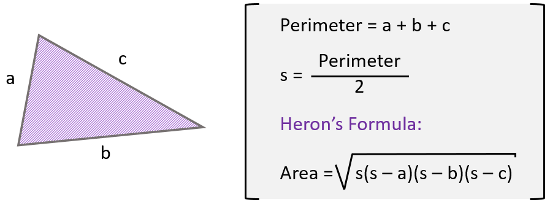
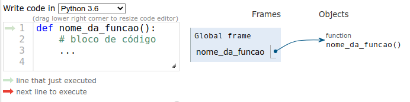
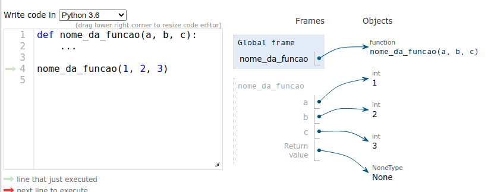
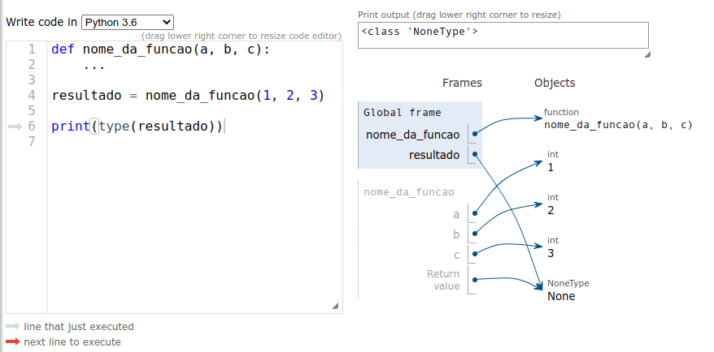

# Criando Funções

Função, na matemática é a uma estrutura que relaciona um conjunto A (dominio) a um conjunto B (contradominio) e seu subconjunto (imagem).

A função da programação é um pouco diferente mas opera de maneira bastante similar, a função na programação recebe um input com um conjunto de dados (dominio) e opera este conjunto com relação ao seu resultado de retorno (contradominio).

```text
f(x) = 5 * (x / 2)
```

Calma, nosso objetivo aqui por enquanto não é a matemática, apenas a estrutura da função.

Em programação é chamada de função um bloco pre-definido de código que recebe em seu input um conjunto de dados (argumentos), aplica um algoritmo e retorna um resultado (retorno).

```python
def f(x):
    return 5 * (x / 2)
```

As funções podem ser usadas para descrever fórmulas matemáticas como a do exemplo anterior, pois assim como na matemática as linguagens de programação oferecem as estruturas necessárias como variáveis, conjuntos e operadores.



Em Python

```python
def heron(a, b, c):
    perimeter = a + b + c 
    s = perimeter / 2
    area = (s * (s - a) * (s - b) * (s - c)) ** 0.5
    return area
```

Agora em qualquer parte do programa você pode reutilizar essa função quando precisar da area de um triangulo.

Calculando a area de um triangulo:

```python
a = int(input("Digite o valor de a: ").strip())
b = int(input("Digite o valor de b: ").strip())
c = int(input("Digite o valor de c: ").strip())

print("A área do triângulo é: ", heron(a, b, c))
```

Calculando a area de multiplos triangulos:

```python
triangulos = [
    (3, 4, 5),
    (5, 12, 13),
    (8, 15, 17),
    (12, 35, 37),
    (3, 4, 5),
    (5, 12, 13),
    (8, 15, 17),
    (12, 35, 37)
]
for t in triangulos:
    print("A área do triângulo é: ", heron(t[0], t[1], t[2]))

# Ou usando unpacking
for t in triangulos:
    print("A área do triângulo é: ", heron(*t))
```

### Anatomia de uma função

A função é declarada usando a keyword `def` seguida de seu nome, seguido de parênteses `()` e o marcador de bloco de código `:`.

```python
def nome_da_funcao():
    # bloco de código
```

O nome de uma função é apenas um identificador, uma variável que aponta para o objeto função, nomeamos as funções usando `snake_case` e seguindo as mesmas restrições de nomes de variáveis.



A função pode receber um ou mais argumentos, que são os valores que serão passados para a função utilizar em seu algoritmo.

Cada argumento da função é uma variável, um identificador que vai apontar para o objeto que for passado para a função.

Fazemos a chamada de função (também falamos "invocação da função") usando o nome da função, seguido de parênteses `()` e os valores que serão passados para os argumentos da função.

```python
def nome_da_funcao(a, b, c):
    ...

nome_da_funcao(1, 2, 3)
```




Toda função tem um retorno, que é o valor que será retornado pela função, quando não especificado, o retorno é sempre `None`.

```python
def nome_da_funcao(a, b, c):
    ...

resultado = nome_da_funcao(1, 2, 3)

print(type(resultado))
```




Podemos especificar o retorno da função usando a keyword `return` sempre na última linha do bloco de código.

```python
def nome_da_funcao(a, b, c):
    return a + b + c

resultado = nome_da_funcao(1, 2, 3)
print(resultado)
```


