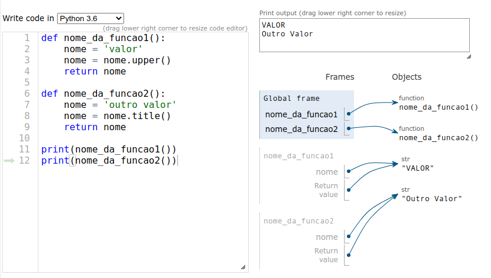
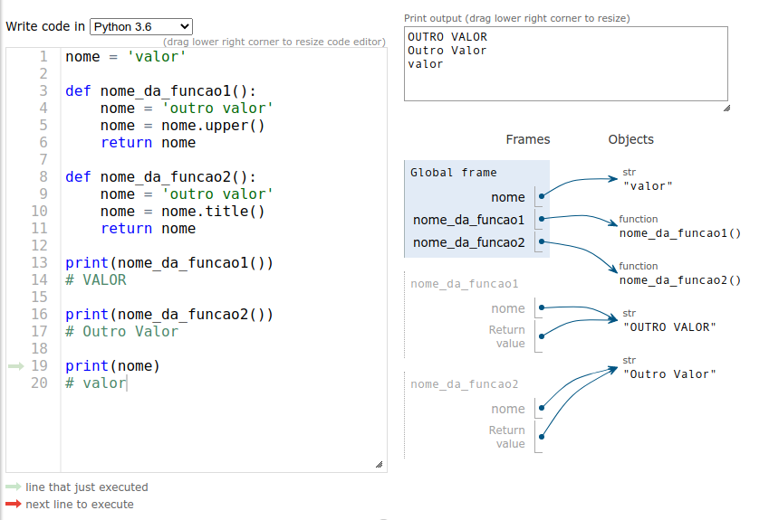
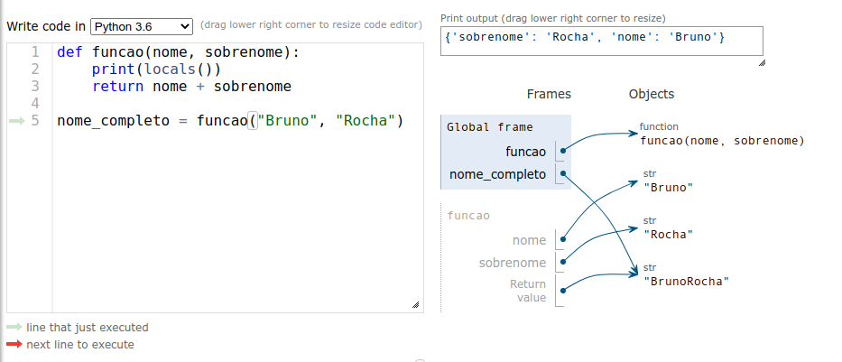
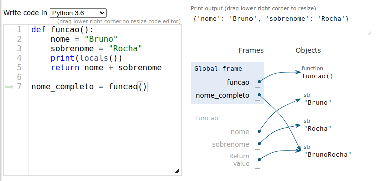

## Escopo

Agora que já falamos sobre a anatomia de uma função, vamos falar sobre o escopo de uma função.

Um **escopo** é similar a um **namespace**, um espaço do código onde os **nomes** são definidos. O isolamento de **escopo** é importante para que não haja conflito de nomes entre os identificadores.

Por exemplo, se tivermos duas funções e dentro do bloco de código de ambas funções atribuirmos uma variável `nome`, o Python cria dentro de cada função um escopo chamado `local` e define esse valor apenas ali dentro.

```python
def nome_da_funcao1():
    nome = 'valor'
    nome = nome.upper()
    return nome

def nome_da_funcao2():
    nome = 'outro valor'
    nome = nome.title()
    return nome

print(nome_da_funcao1())
# VALOR

print(nome_da_funcao2())
# Outro Valor
```



Repare que apesar de terem o mesmo nome, cada função tem a sua própria variavel `nome` e este identificador existe apenas dentro da função. (`nome` não faz parte do `global frame`)

Em um programa Python existem os seguintes escopos:


Vamos ver como isso ficaria no código abaixo:

```python
nome = 'valor'

def nome_da_funcao1():
    nome = 'outro valor'
    nome = nome.upper()
    return nome

def nome_da_funcao2():
    nome = 'outro valor'
    nome = nome.title()
    return nome

print(nome_da_funcao1())
# VALOR

print(nome_da_funcao2())
# Outro Valor

print(nome)
# valor
```



E ao criar uma variável `nome = "valor"` no escopo principal, ou seja, o escopo global, ela não conflita com as variáveis existentes dentro das funções.

O `nome` do `global frame` não é o mesmo do `nome`da `funcao1` que não é o mesmo `nome` da `funcao2`.

Para verificar todas as variáveis do escopo global, podemos usar a função `globals()`.

E dentro de uma função, para verificar todas as variáveis do escopo local, podemos usar a função `locals()`.

### Posso acessar uma variável global dentro da função?

Python decide qual é o escopo de uma variável quando a mesma é definida, no momento da atribuição, portanto, ao criar `nome = "valor"` dentro de uma função, o Python determina que `nome` pertence ao escopo local e não permite acessar a variável `nome` do escopo global.

```python
nome = 'valor'  # variável global

def funcao1():
    nome = 'outro valor'  # variável local
    # alteração ocorre apenas no escopo local
    nome = nome.upper()  
    return nome  # o valor de retorno é o da variável local

print(funcao1())  # O valor de retorno é acessado
# OUTRO VALOR

print(nome)  # Continua com o valor da variável global
# valor
```

Mas se por acaso quisermos acessar a variável `nome` do escopo global, podemos usar a função `globals()` que é um dicionário que contém todas as variáveis do escopo global.

```python
nome = 'valor'  # variável global

def funcao1():
    nome = 'outro valor'  # variável local
    nome = nome + globals()['nome']  # acesso a variável global  
    return nome  # o valor de retorno é o da variável local

print(funcao1())  # O valor de retorno é acessado
# outro valorvalor

print(nome)  # Continua com o valor da variável global
# valor
```

E se a sua função não fizer atribuição a uma variável com o mesmo nome de uma variável global, então Python irá tentar acessar a variável global caso ela não exista no escopo local.

```python
nome = "valor"  # variável global

def funcao1():
    return nome.upper()  # acesso a variável global

print(funcao1())
# VALOR
```

### Posso alterar o valor de uma variável global dentro de uma função?

Se o valor da variável global for imutável, então para alterar o apontamento da variável global precisaremos dizer ao Python que ao invés de estarmos fazendo uma nova atribuição local estamos substituindo o apontamento da variável global.

```python
nome = "valor" # string imutável global

def muda_nome():
    # explicitamante dizemos que a variavel é global
    global nome
    # reatribuição do apontamento da variável global
    nome = "outro valor"  

muda_nome()

print(nome)
# outro valor
```

Outro exemplo

```python
contador = 0

def incrementa_contador():
    global contador
    contador += 1

incrementa_contador()
incrementa_contador()
print(contador)
# 2
```

Quando o valor da variável global for mutável, então podemos diretamente chamar seus métodos para alterar o valor dela.

```python
numeros = [1, 2, 3]

def adiciona_numero(numero):
    numeros.append(numero)

adiciona_numero(4)
adiciona_numero(5)
print(numeros)
# [1, 2, 3, 4, 5]
```

E neste caso não é preciso usar a keyworkd `global` pois não faremos uma reatribuição de apontamento, apenas chamada de método do protocolo do objeto.

### Posso criar uma variável global dentro de uma função?

Sim, basta utilizar a palavra `global` antes da variável que desejamos criar globalmente.

```python
def cria_nome():
    global nome
    nome = "valor"

print(nome)
# NameError: name 'nome' is not defined

cria_nome()
print(nome)
# valor
```

### Escopo de argumentos de função

QUando uma função recebe argumentos, o Python utiliza o nome do argumento para atribuir uma variável local dentro da função.

```python

def funcao(nome, sobrenome):
    print(locals())
    return nome + sobrenome

nome_completo = funcao("Bruno", "Rocha")
```



E isso seria o equivalente a

```python
def funcao():
    nome = "Bruno"
    sobrenome = "Rocha"
    print(locals())
    return nome + sobrenome

nome_completo = funcao()
```



Portanto todas as regras de escopo continuam valendo, porém como argumentos de função são atribuição de variáveis local, então não podemos acessar as variáveis globais com o mesmo nome a não ser através do dict `globals()`.

### Funções com valores default

Os argumentos de uma função podem ter um valor por defeito, em inglês `default` que é o valor que será assumido caso nenhum valor seja passado.

```python
def imprime_nome(nome, sobrenome="Sabugosa"):
    print(nome, sobrenome)

imprime_nome("Bruno")
# Bruno Sabugosa

imprime_nome("Bruno", "Rocha")
# Bruno Rocha
```

Valores default podem ser de qualquer tipo, e devem ser passados apenas depois dos argumentos que não possuem valor default.

### Valores default mutáveis

É importante tomar bastante cuidado com valores mutáveis, pois como já vimos, dentro de uma função, o efeito colateral será a alteração do valor global.

Este é um erro muito comum:

```python

def adiciona_a_lista(valor, lista=[]):
    lista.append(valor)
    return lista

adiciona_a_lista(4)
adiciona_a_lista(5)
print(adiciona_a_lista(6))
# [4, 5, 6]
```

Para resolver esse tipo de problema o recomendado é inicializar o valor default com `None`

```python

def adiciona_a_lista(valor, lista=None):
    if lista is None:
        lista = []
    lista.append(valor)
    return lista

adiciona_a_lista(4)
adiciona_a_lista(5)
print(adiciona_a_lista(6))
# [6]
```

Este cuidado precisa ser tomado com qualquer valor mutável como listas, dicionários, sets.

### Argumentos coringas

Uma função pode ter um comportamento polimórfico ao utilizar argumentos coringas (em inglês: `star arguments`) definidos usando `*args` para argumentos posicionais e `**kwargs` para argumentos nomeados.

```python

def funcao(*args, **kwargs):
    print(args, kwargs)

funcao(1, 2, 3, nome="Bruno", sobrenome="Rocha")
# (1, 2, 3) {'nome': 'Bruno', 'sobrenome': 'Rocha'}

funcao(1, nome="Bruno")
# (1) {'nome': 'Bruno'}

funcao(1)
# (1,) {}

funcao(sobrenome="Rocha")
# () {'sobrenome': 'Rocha'}
```

As variáveis locais `args` e `kwargs` são uma tupla e um dicionário que podem ser acessados normalmente dentro da função.