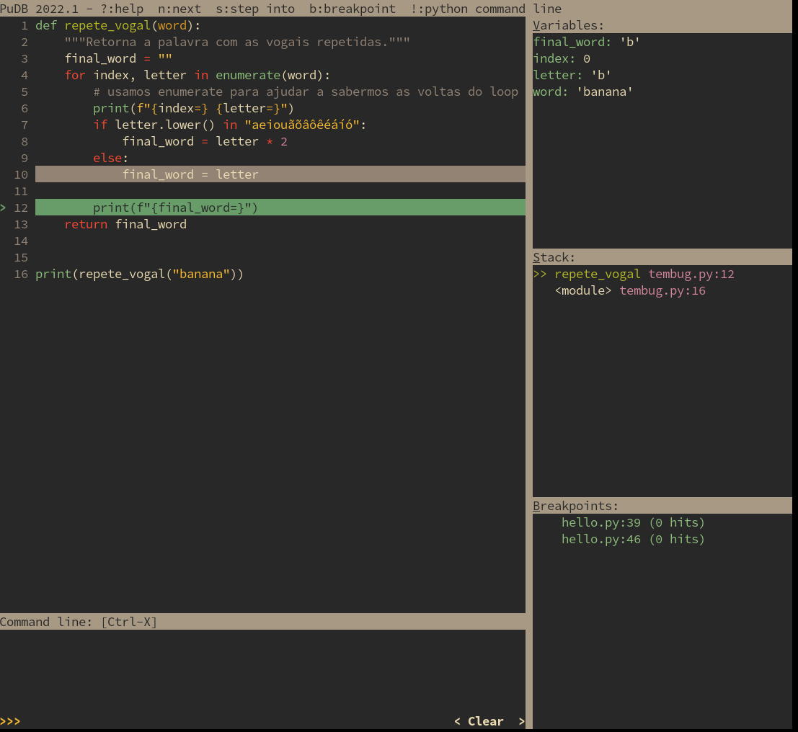
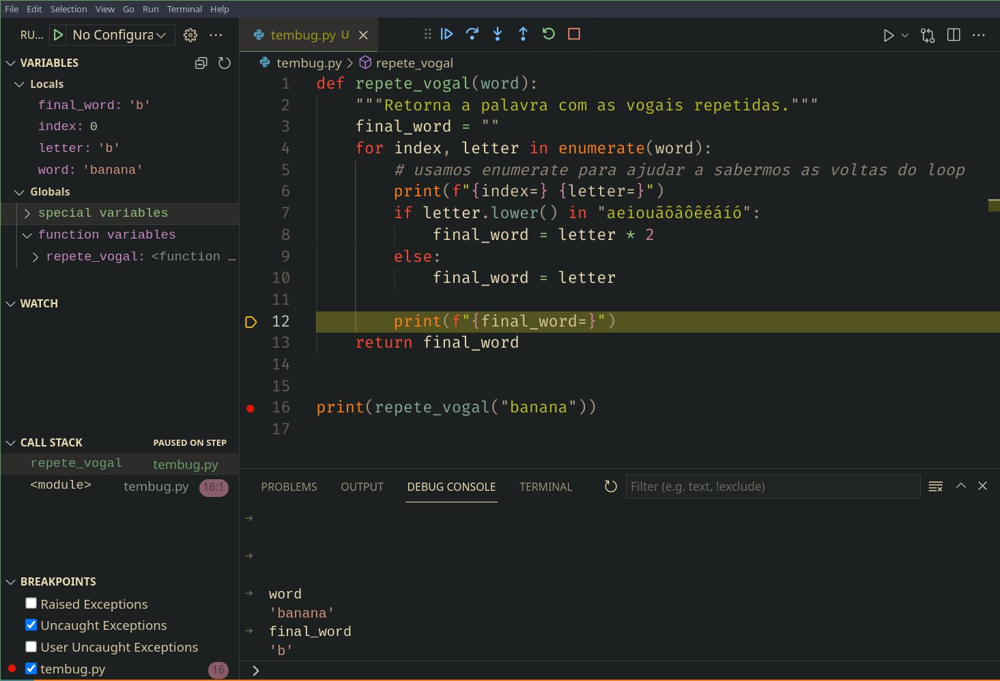

# Debugging

Debugging é o processo de em caso de **erros**, **comportamento inesperado** ou em necessidade de **análise** detalhada
de um algoritmo, efetuar a execução linha a linha inspecionando os objetos da stack.

A maior útilidade de debugging é descobrir a raiz de um problema não previsto em um algoritmo,
Python oferece algumas abordagens para debugging.


Vamos pegar como exemplo nosso programa que repete vogais em um texto e criar uma função:


`tembug.py`
```py
def repete_vogal(word):
    """Retorna a palavra com as vogais repetidas."""
    final_word = ""
    for letter in word:
        if letter.lower() in "aeiouãõâôêéáíó":
            final_word = letter * 2
        else:
            final_word = letter
    return final_word

print(repete_vogal("banana"))
```

Ao executar esperamos a impressão de `baanaanaa` no terminal mas o que temos é `aa` o que significa que nosso programa tem
um bug.

> Se você já percebeu onde está o erro **finja que não viu :)** o objetivo desta aula é mostrar as ferramentas de debugging para
> encontrar o problema.

## Execução interativa

```bash
python -i tembug.py
# aqui estamos em um terminal onde temos acesso a função
>>> repete_vogal("Bruno")
'oo' 
```

## Prints

Prints são uma das formas úteis e práticas de debugging, quando prodemos executar o programa indefinidamente para reproduzir o
erro e no meio da execução acompanhar a saída do terminal o uso de um `print` é com certeza a solução e junto com `f-string`
torna-se uma ferramenta bastante completa.

```py
def repete_vogal(word):
    """Retorna a palavra com as vogais repetidas."""
    final_word = ""
    for index, letter in enumerate(word):  
        # usamos enumerate para ajudar a sabermos as voltas do loop
        print(f"{index=} {letter=}")
        if letter.lower() in "aeiouãõâôêéáíó":
            final_word = letter * 2
        else:
            final_word = letter

        print(f"{final_word=}")
    return final_word

print(repete_vogal("banana"))
```

Ao executar

```bash
index=0 letter='b'
final_word='b'
index=1 letter='a'
final_word='aa'
index=2 letter='n'
final_word='n'
index=3 letter='a'
final_word='aa'
index=4 letter='n'
final_word='n'
index=5 letter='a'
final_word='aa'
aa
```

Usando `{variavel=}` a partir do Python 3.8 em uma f-string teremos uma impressão fácil para debugging.

Com esta saída do `print` já podemos descobrir o que está acontecendo, porém se ainda assim não tenha ficado claro
podemos partir para outras abordagens.

## pdb

`pdb` é a ferramenta padrão de debugging interativo do Python e além de ser uma ferramenta bastante tradicional também
se tornou um padrão adotado por todos os outros debuggers.

### Executando o script com pdb

```bash
python -m pdb tembug.py                                
> /home/rochacbruno/Projects/python-base/tembug.py(1)<module>()
-> def repete_vogal(word):
(Pdb)
```

O debugger irá iniciar a execução do script porém irá parar na primeira linha e ficar esperando nosso comando, além
disso irá expor um prompt onde podemos interagir com a `stack` de execução.

O `pdb` tem alguns comandos útis que pode visualizar digitando `?` ou `help`

```plain
(Pdb) help

Documented commands (type help <topic>):
========================================
EOF    c          d        h         list      q        rv       undisplay
a      cl         debug    help      ll        quit     s        unt      
alias  clear      disable  ignore    longlist  r        source   until    
args   commands   display  interact  n         restart  step     up       
b      condition  down     j         next      return   tbreak   w        
break  cont       enable   jump      p         retval   u        whatis   
bt     continue   exit     l         pp        run      unalias  where    

Miscellaneous help topics:
==========================
exec  pdb
```

vamos abordar apenas alguns deles:

Digitando `l` ele mostra qual a linha de execução atual:

```py
(Pdb) l
  1  -> def repete_vogal(word):
  2         """Retorna a palavra com as vogais repetidas."""
```

Digitando `n` ele executa o bloco atual e pula para o próximo:

```py
(Pdb) n
> /home/rochacbruno/Projects/python-base/tembug.py(16)<module>()
-> print(repete_vogal("banana"))
```

Digitando `s` ele entra na execução de uma chamada de função repare no `__call__`:

```py
(Pdb) s
--Call--
> /home/rochacbruno/Projects/python-base/tembug.py(1)repete_vogal()
-> def repete_vogal(word):
```

E então digitando `n` seguidas vezes vai passo a passo executando a função:

```py
(Pdb) n
> /home/rochacbruno/Projects/python-base/tembug.py(3)repete_vogal()
-> final_word = ""
(Pdb) n
> /home/rochacbruno/Projects/python-base/tembug.py(4)repete_vogal()
-> for index, letter in enumerate(word):
(Pdb) n
> /home/rochacbruno/Projects/python-base/tembug.py(6)repete_vogal()
-> print(f"{index=} {letter=}")
(Pdb) n
index=0 letter='b'
> /home/rochacbruno/Projects/python-base/tembug.py(7)repete_vogal()
-> if letter.lower() in "aeiouãõâôêéáíó":
(Pdb) letter
'b'
(Pdb) index
0
```

E em cada instrução podemos visualizar o valor de variáveis definidas, e para saber onde
estamos basta digitar `l`


```py
(Pdb) l
  2         """Retorna a palavra com as vogais repetidas."""
  3         final_word = ""
  4         for index, letter in enumerate(word):
  5             # usamos enumerate para ajudar a sabermos as voltas do loop
  6             print(f"{index=} {letter=}")
  7  ->         if letter.lower() in "aeiouãõâôêéáíó":
  8                 final_word = letter * 2
  9             else:
 10                 final_word = letter
 11  
 12             print(f"{final_word=}")
```

Para forçar o programa a rodar até uma determinada linha podemos criar `breakpoints`

```py
(Pdb) b 12
Breakpoint 1 at /home/rochacbruno/Projects/python-base/tembug.py:12
```

E então pressionando `c` o programa irá executar até chegar ao breakpoint definido na linha 12.

```py
(Pdb) c
> /home/rochacbruno/Projects/python-base/tembug.py(12)repete_vogal()
-> print(f"{final_word=}")
```

E pressionando `c` novamente o programa roda até a próxima volta do loop e assim consecutivamente.

```py
(Pdb) c
final_word='b'
index=1 letter='a'
> /home/rochacbruno/Projects/python-base/tembug.py(12)repete_vogal()
-> print(f"{final_word=}")
(Pdb) c
final_word='aa'
index=2 letter='n'
> /home/rochacbruno/Projects/python-base/tembug.py(12)repete_vogal()
-> print(f"{final_word=}")
(Pdb) c
final_word='n'
index=3 letter='a'
> /home/rochacbruno/Projects/python-base/tembug.py(12)repete_vogal()
-> print(f"{final_word=}")
(Pdb) c
final_word='aa'
index=4 letter='n'
> /home/rochacbruno/Projects/python-base/tembug.py(12)repete_vogal()
-> print(f"{final_word=}")
```

Digitando `l` irá mostrar onde está o breakpoint

```py
(Pdb) l
  7             if letter.lower() in "aeiouãõâôêéáíó":
  8                 final_word = letter * 2
  9             else:
 10                 final_word = letter
 11  
 12 B->         print(f"{final_word=}")
 13         return final_word
 14  
 15  
 16     print(repete_vogal("banana"))
```

e digitando `b` mostra os breakpoints definidos e quantas vezes já foram executados.

```py
(Pdb) b
Num Type         Disp Enb   Where
1   breakpoint   keep no    at /home/rochacbruno/Projects/python-base/tembug.py:12
        breakpoint already hit 6 times
```

E para remover um breakpoint basta chamar o comando `disable` seguido do Num

```py
(Pdb) disable 1
Disabled breakpoint 1 at /home/rochacbruno/Projects/python-base/tembug.py:12
```

e por fim digitando `c` o programa continua executando até o final.

```py
(Pdb) c
final_word='aa'
aa
The program finished and will be restarted
```

Para sair do debugger utilize `q` ou `ctrl + C`


### Usando breakpoints condicionais

Para executar até uma determinada linha:

```bash
$ python -m pdb -c "until 12" tembug.py 
> /home/rochacbruno/Projects/python-base/tembug.py(16)<module>()
-> print(repete_vogal("banana"))
(Pdb) 
```

Para executar somente em caso de uma exception ser carregada:

altere a linha 3 do arquivo para forçar uma exception:
```bash
def repete_vogal(word):
    """Retorna a palavra com as vogais repetidas."""
    1 / 0
    final_word = ""

```
e execute com `-c continue`

```bash
$ python -m pdb -c continue tembug.py
Traceback (most recent call last):
  File "/usr/lib/python3.10/pdb.py", line 1723, in main
    pdb._runscript(mainpyfile)
  File "/usr/lib/python3.10/pdb.py", line 1583, in _runscript
    self.run(statement)
  File "/usr/lib/python3.10/bdb.py", line 597, in run
    exec(cmd, globals, locals)
  File "<string>", line 1, in <module>
  File "/home/rochacbruno/Projects/python-base/tembug.py", line 17, in <module>
    print(repete_vogal("banana"))
  File "/home/rochacbruno/Projects/python-base/tembug.py", line 3, in repete_vogal
    1 / 0
ZeroDivisionError: division by zero
Uncaught exception. Entering post mortem debugging
Running 'cont' or 'step' will restart the program
> /home/rochacbruno/Projects/python-base/tembug.py(3)repete_vogal()
-> 1 / 0
(Pdb) word
'banana'
```

## Breakpoints explicitos

Em qualquer linha de código onde deseja que o debugger pare a execução:

```py
import pdb;pdb.set_trace()
```

ou

```py
__import__("pdb").set_trace()
```

ou a partir do Python 3.7

```py
breakpoint()
```

## Variações do protocolo pdb

### ipdb

`pip install ipdb`

Ao trocar `pdb` por `ipdb` e executar teremos a mesma experiência porém dentro de um terminal ipython

```py
$ python -m ipdb -c "until 16" tembug.py
> /home/rochacbruno/Projects/python-base/tembug.py(16)<module>()
     14 
     15 
---> 16 print(repete_vogal("banana"))

ipdb> 
```

Com a vantagem de um comando adicional chamado `interact` que permite redefinir objetos e funções com facilidade.


```py
ipdb> interact
*interactive*
In [1]: repete_vogal("banana")
Out [2]: 'aa'
In [2]: exit
*exiting interactive console...*
ipdb>
```

É possível configurar o `ipdb` como debugger default para o Python através de uma variável de ambiente:

```bash
export PYTHONBREAKPOINT=ipdb.set_trace                 
 
❯ python tembug.py         
> /home/rochacbruno/Projects/python-base/tembug.py(6)repete_vogal()
      5         breakpoint()
----> 6         if letter.lower() in "aeiouãõâôêéáíó":
      7             final_word = letter * 2
ipdb>
```

### Debugger visual no terminal 

`pip install pudb`

E substituindo por `pudb`

```
python -m pudb tembug.py
```



O VSCode também tem um debugger integrado que permite a interação visual e através do terminal.




## E afinal onde estava o bug?

Percebi que no vídeo não solucionamos o bug, e não tem problema pois a intenção era justamente aprender a usar as ferramentas de debugging.

Mas o erro está dentro do loop for.

Código errado:

```py
def repete_vogal(word):
    """Retorna a palavra com as vogais repetidas."""
    final_word = ""
    for letter in word:
        if letter.lower() in "aeiouãõâôêéáíó":
            final_word = letter * 2  # <- Aqui tem que ser `+=`
        else:
            final_word = letter # <- Aqui tem que ser `+=`
    return final_word

print(repete_vogal("banana"))
```

Código correto

```py
def repete_vogal(word):
    """Retorna a palavra com as vogais repetidas."""
    final_word = ""
    for letter in word:
        if letter.lower() in "aeiouãõâôêéáíó":
            final_word += letter * 2  
        else:
            final_word += letter
    return final_word

print(repete_vogal("banana"))
```

