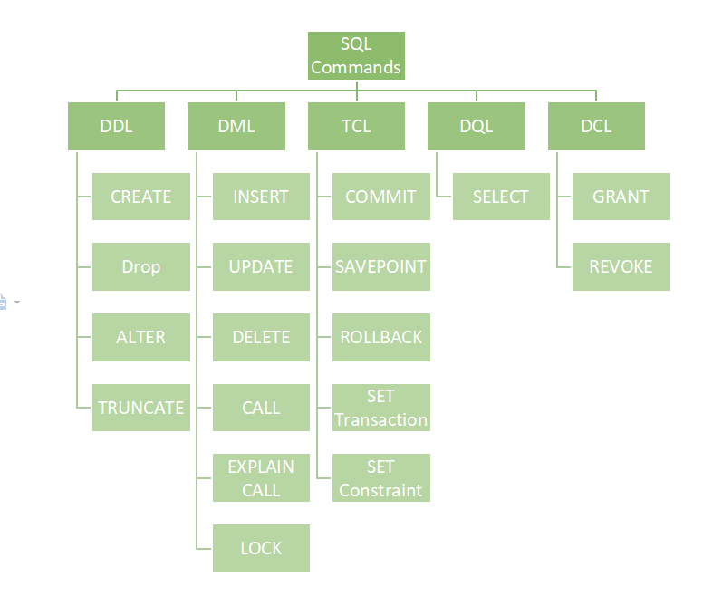
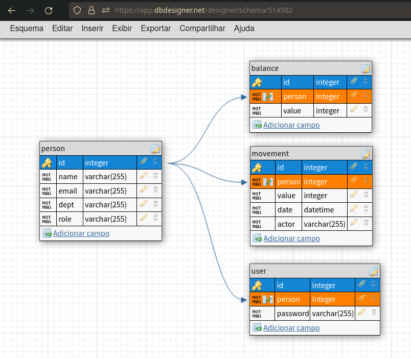
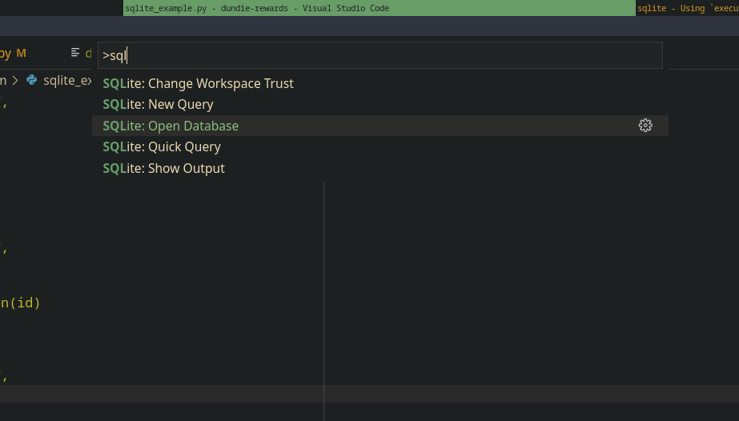
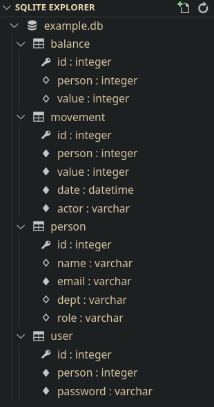

# Sistema de Banco de Dados 

Uma das formas mais populares para armazenagem de dados é o uso de 
sistemas de gerenciamento de bancos de dados SGBD, esses sistemas
geralmente seguem padrões como ANSI SQL, PL SQL ou NoSQL.

A sigla SQL significa Structured Query Language e é uma linguagem padronizada
para descrever, consultar e alterar dados.

Ao contrário do arquivo JSON que usamos em nosso projeto, os bancos de dados
armazenam seus dados em formatos binários que são muito mais performáticos e 
ocupam menos espaço e uma outra vantagem em usar um sistema desses é que é 
possível fazer relacionamentos entre as tabelas (JOINS) e também oferecem
algumas proteções e validações que seriam muito dificeis de implementar na
camada de programação.

As plataformas mais famosas para gerenciar banco de dados no Python são
Postgresql, MySQL e SQLite.

O SQLite é o sistema de bancos de dados mais usado no mundo, atualmente todo
dispositivo móvel com Android ou Ios tem uma dezena de bancos SQLite para 
guardar os dados dos apps.

Uma caracteristica interessante do SQLite é que ele não exige a instalação de
uma plataforma completa de banco de dados, os dados são salvos em um arquivo
binário e podemos usar a biblioteca built-in do Python chamada `sqlite3`.

## O que é um banco de dados

Virtualmente, um banco de dados é um sistema organizado atráves de:

- Tabela: Espaço para armazenar dados (análoga a uma planilha em excel)
- Coluna: Cada um dos atributos de um registro, análogo a `fields` ou atributos de uma classe ou colunas de uma planilha excel.
- Registro: Também chamado de `linha` ou `row` é cada um dos registros do banco de dados.
- Chaves: Informações especiais que determinam chaves de acesso e relacionamento, e.x: Primary Key
- Indices: Uma coleção otimizada de chaves -> registro (como uma hash table que vimos na aula de tipos de dados) que permite acesso mais rápido em tabelas grandes.

## A linguagem SQL

A linguagem SQL está dividida em algumas categorias de comandos:

* DDL - Data Definition Language - Comandos usados para definir objetos
* DML - Data Manipulation Language - Comandos para manipular dados
* TCL - Transaction Control Language - Comandos usados para estabelecer transações
* DQL - Data Query Language - Comandos usados para consultar dados
* DCL - Data Control Language - Comandos para definir controle de acesso




## Se comunicando com o banco de dados

Em sistemas como Postgres ou MySQL para
se comunicar com o banco de dados precisariamos primeiro ter o sistema rodando como um serviço, e isso pode ser
feito utilizando containeres por exemplo e a comunicação é feita através de sockets ou TCP network.

No caso do SQLite como ele é um sistema de banco de dados embutido na linguagem Python, nós só precisaremos de um arquivo com a extensão `.db` e usar a bibliteca `sqlite3`

[https://docs.python.org/3/library/sqlite3.html](https://docs.python.org/3/library/sqlite3.html)

Conectando ao banco de dados:

```py
import sqlite3
con = sqlite3("example.db")
```

Caso o arquivo `example.db` não exista ele será criado, além do caminho para um arquivo o sqlite também permite o uso
de `:memory:` que faz com que o bando de dados seja armazenado apenas na memória RAM e seja perdido após a execução do programa, o que é útil para
testes.

Executando comandos

```py
con.execute("Instrução SQL")
```

Salvando os dados

```py
con.commit()
```

Fechando a conexão com o banco de dados:

```py
con.close()
```

## Definindo tabelas

Para definir tabelas usaremos um  comando da linguagem DDL.

- CREATE - comando para criar tabela

```sql
CREATE TABLE person (
    id integer PRIMARY KEY AUTOINCREMENT,
    name varchar,
    email varchar UNIQUE NOT NULL,
    dept varchar,
    role varchar
);
```

Exemplo com python

```py
import sqlite3

con = sqlite3.connect("/tmp/example.db")

instruction = """\
CREATE TABLE if not exists person (
    id integer PRIMARY KEY AUTOINCREMENT,
    name varchar,
    email varchar UNIQUE NOT NULL,
    dept varchar,
    role varchar
);
"""

con.execute(instruction)
con.close()
```

> Caso a tabela já exista o SQLITE vai subir um erro `sqlite3.OperationalError`
> portanto é útil colocar a condicional `if not exists` na instrução.

## Relacionamentos

A principal vantagem de usar SQL é a sua caracteristica relacional, podemos
definir relacionamentos entre tabelas para posteriormente facilitar a consulta
de informações.

> **NOTA** Por padrão o SQLite não suporta a expressão `FOREIGN KEY(person) REFERENCES person(id)` que faz o relacionamento entre as tabelas, para este suporte ser ativado é necessário executar `con.execute("PRAGMA foreign_keys = ON;")`

Exemplo:

```py
instruction = """\
CREATE TABLE if not exists balance (
    id integer PRIMARY KEY AUTOINCREMENT,
    person integer,
    value integer,
    FOREIGN KEY(person) REFERENCES person(id)
);
"""
con.execute(instruction)
```

A expressão `FOREIGN KEY(person) REFERENCES person(id)` faz com que o campo `person` da tabela `balance` seja relacionado ao campo `id` da tabela `person`, esses 2 campos são apenas inteiros e em teoria basta setarmos os IDs em cada campo para existir um relacionamento, porém com a criação de uma `FOREIGN KEY` criamos uma `constraint` que é uma validação para que somente IDs existentes na table `person` possa ser usado.

## Modelagem do Banco de dados dundie

Com isso podemos usar essas instruções para modelar nosso banco de dados em SQL,
uma ferramenta bastante útil e a [https://app.dbdesigner.net/](https://app.dbdesigner.net/)



O Esquema pode ser acessado neste link [https://app.dbdesigner.net/designer/schema/0-dundie](https://app.dbdesigner.net/designer/schema/0-dundie)

O Db DEsigner permite exportar as instruções SQL para a criação das tabelas.

```sql
CREATE TABLE if not exists person (
	id integer PRIMARY KEY AUTOINCREMENT,
	name varchar NOT NULL,
	email varchar UNIQUE NOT NULL,
	dept varchar NOT NULL,
	role varchar NOT NULL
);

CREATE TABLE if not exists balance (
	id integer PRIMARY KEY AUTOINCREMENT,
	person integer UNIQUE NOT NULL,
	value integer NOT NULL,
	FOREIGN KEY(person) REFERENCES person(id)
);

CREATE TABLE if not exists movement (
	id integer PRIMARY KEY AUTOINCREMENT,
	person integer NOT NULL,
	value integer NOT NULL,
	date datetime NOT NULL,
	actor varchar NOT NULL,
	FOREIGN KEY(person) REFERENCES person(id)
);

CREATE TABLE if not exists user (
	id integer PRIMARY KEY AUTOINCREMENT,
	person integer UNIQUE NOT NULL,
	password varchar NOT NULL,
	FOREIGN KEY(person) REFERENCES person(id)
);
``` 

E podemos executar cada uma dessas instruções com Python, o detalhe é que
este tipo de instrução precisa ser executado um por um com `con.execute` e uma
maneira de fazer isso é usando `split`

## Criando as tabelas com Python

> **NOTA** separamos cada instrução com `---` para depois fazermos o `split`.

```py
import sqlite3

con = sqlite3.connect("example.db")
con.execute("PRAGMA foreign_keys = ON;")


instructions = """\
CREATE TABLE if not exists person (
    id integer PRIMARY KEY AUTOINCREMENT,
    name varchar NOT NULL,
    email varchar UNIQUE NOT NULL,
    dept varchar NOT NULL,
    role varchar NOT NULL
);
---
CREATE TABLE if not exists balance (
    id integer PRIMARY KEY AUTOINCREMENT,
    person integer UNIQUE NOT NULL,
    value integer NOT NULL,
    FOREIGN KEY(person) REFERENCES person(id)
);
---
CREATE TABLE if not exists movement (
    id integer PRIMARY KEY AUTOINCREMENT,
    person integer NOT NULL,
    value integer NOT NULL,
    date datetime NOT NULL,
    actor varchar NOT NULL,
    FOREIGN KEY(person) REFERENCES person(id)
);
---
CREATE TABLE if not exists user (
    id integer PRIMARY KEY AUTOINCREMENT,
    person integer UNIQUE NOT NULL,
    password varchar NOT NULL,
    FOREIGN KEY(person) REFERENCES person(id)
);
"""

for instruction in instructions.split("---"):
    con.execute(instruction)
```

Ao executar o código acima o SQLite irá criar o arquivo `example.db` no mesmo
diretório em que o script foi executado e então podemos usar a extensão SQLite
do Vscode para abrir o banco de dados.

`Ctrl + Shift + P` e digite SQLite e escolha a opção `Open database` e depois selecione
o arquivo `example.db`



Ao abrir o arquivo o SQLite adiciona na barra lateral do Vscode a listagem
das tabelas do banco de dados.



## Manipulando dados.

Agora usaremos a DML (Data Manipulation Language) e instruções como `INSERT`, `UPDATE` e `DELETE` para manipular os dados.

Podemos fazer isso diretamante no VScode clicando na tabela person e selecionando `New Query Insert`

> Podemos omitir o campo `id` que o sqlite irá criar automaticamente.

```sql
-- SQLite
INSERT INTO person (name, email, dept, role)
VALUES ('Bruno', 'bruno@rocha.com', 'Sales', 'Manager');
```

Para executar use `Ctrl + Shift + Q` ou na barra do vscode escolha `SQLite run query`

E agora podemos clicar novamente na tabela e escolher `New Query Select`

```sql
-- SQLite
SELECT id, name, email, dept, role
FROM person;
```


E para efetuar a mesma operação utilizando Python

```py
import sqlite3

con = sqlite3.connect("/tmp/example.db")

instruction = """\
INSERT INTO person (name, email, dept, role)
VALUES ('Karla', 'karla@rocha.com', 'Engineering', 'Programmer');
"""
con.execute(instruction)
con.commit()
```

Agora para fazer uma consulta utilizando Python usamos a DQL (Data Query Language)
sempre que fizermos uma consulta (SELECT) precisamos passar o comando para um objeto `Cursor` obtido com `con.cursor()`

```py
instruction = """\
SELECT id, name, email, dept, role
FROM person ORDER BY name;
"""

cur = con.cursor()
result = cur.execute(instruction)  # sqlite3.Cursor

for row in result: # Cursor implementa o protocolo Iterable
    print(row)
```

E o resultado será obtive através de tuplas Python.

```py
(1, 'Bruno', 'bruno@rocha.com', 'Sales', 'Manager')
(2, 'Karla', 'karla@rocha.com', 'Engineering', 'Programmer')
```

> **NOTA** repare que o resultado não inclui os nomes das colunas, apenas os dados
> portanto a ordem de definição dos campos na consulta é muito importante.

## Relacionamentos

A vantagem de usar SQL são os `JOINS` vamos ver como isso funciona, primeiro
adicionando um registro na tabela balance para cada um dos nossos funcionários:

1. Selecionamos os ids da tabela person, seguidos pelo valor 100
   essa query resultará em um objeto `Cursor([1, 100], [2, 100])`
2. Utilizando loop for iteramos nos resultados e executamos uma instrução `DML`
   (INSERT) para adicionar dados em outra tabela e para preencher os ids de 
   cada pessoa usamos os placeholders do SQLite com `?`. 
    > **IMPORTANTE** instruções DML rodam em cima do objeto `Connection` (cur).
3. É muito importante executar `con.commit` ao final.

```py
cur = con.cursor()
result = cur.execute("SELECT id, 100 FROM person ORDER BY name;") 
for row in result:
    instruction = "INSERT INTO balance (person, value) VALUES (?, ?)"
    con.execute(instruction, row)
con.commit()
```

Agora na tabela balance teremos:

```text
person	value
1	    100
2	    100
```

### E como fazemos para consultar os dados das pessoas da tabela `person` junto com seus saldos da tabela `balance`?

Para obter nome e emails da tabela `person` usamos a query:

```sql
SELECT person.name, person.email FROM person;
```

Para obter os valores da tabela `balance` usamos:

```sql
SELECT balance.value FROM balance;
```


E para juntar as duas tabelas usamos `LEFT JOIN`:

```sql
SELECT person.name, person.email, balance.value 
from person 
LEFT JOIN balance 
WHERE person.id = balance.person; 
```

E obtemos

```text
name	email	        value
Bruno	bruno@rocha.com	100
Karla	karla@rocha.com 100
```

E para fazer isso no Python basta executar essa mesma instrução:

```py
instruction = """\
SELECT person.name, person.email, balance.value
from person
LEFT JOIN balance
WHERE person.id = balance.person
"""
cur = con.cursor()
result = cur.execute(instruction)
for row in result:
    print(row)
```
e recebemos `tuplas` de retorno.

```
('Bruno', 'bruno@rocha.com', 100)
('Karla', 'karla@rocha.com', 100)
```

## Conclusão

Executar instruções SQL desta maneira "crua" pode ser necessário em alguns
projetos, nós podemos automatizar boa parte da geração dessas instruções
utilizando orientação a objetos, por exemplo, a partir das `__annotations__`
de uma classe `Person` poderiamos gerar a instrução `DDL`(`CREATE TABLE`) para
esta classe.

Se você tiver interesse e tempo livre, recomendo pegar o nosso exemplo de código 
com ORM e tentar alterar de arquivo JSON para banco de dados.

Porém, já existem ferramentas que automatizam todo esse esforço e que são 
bastante estabelecidas no mundo Python e na próxima aula falaremos sobre
uma dessas ferramentas colocando em prática em nosso projeto.


Algumas ferramantas interessantes são

- Dataset [https://dataset.readthedocs.io/en/latest/](https://dataset.readthedocs.io/en/latest/)
- TinyDB [https://tinydb.readthedocs.io](https://tinydb.readthedocs.io)
- PonyORM [https://ponyorm.org/](https://ponyorm.org/)
- Peewee ORM [http://docs.peewee-orm.com](http://docs.peewee-orm.com)
- **SQLModel ✨** [https://sqlmodel.tiangolo.com/](https://sqlmodel.tiangolo.com/)

